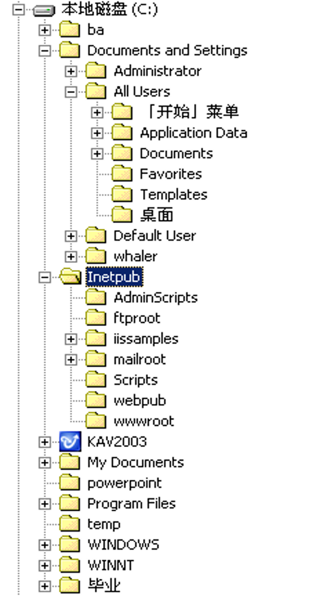
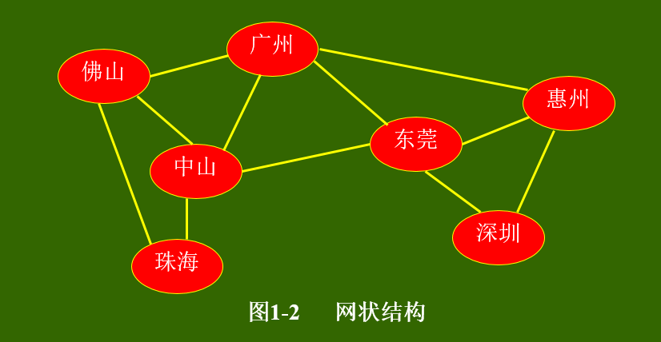
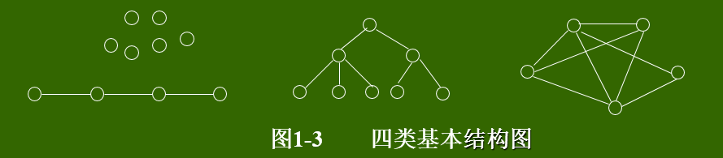
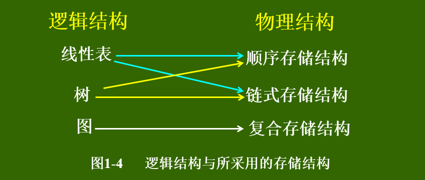

# 数据逻辑与算法-学习笔记

标签（空格分隔）： 数据逻辑与算法 C

---

## 第一章 绪论

目前，计算机已深入到社会生活的各个领域，其应用已不再仅仅局限于科学计算，而更多的是用于控制，管理及数据处理等非数值计算领域。计算机是一门研究用计算机进行信息表示和处理的科学。这里面涉及到两个问题：信息的表示，信息的处理。

信息的表示和组织又直接关系到处理信息的程序的效率。随着应用问题的不断复杂，导致信息量剧增与信息范围的拓宽，使许多系统程序和应用程序的规模很大，结构又相当复杂。因此，必须分析待处理问题中的对象的特征及各对象之间存在的关系，这就是数据结构这门课所要研究的问题。

### 计算机求解问题的一般步骤

编写解决实际问题的程序的一般过程：
> * 如何用数据形式描述问题?—即由问题抽象出一个适当的数学模型;
> * 问题所涉及的数据量大小及数据之间的关系;
> * 如何在计算机中存储数据及体现数据之间的关系?
> * 处理问题时需要对数据作何种运算?
> * 所编写的程序的性能是否良好?

以上问题将在数据结构这门课中得带解答。

### 1.1 数据结构及其概念

《算法与数据结构》是计算机科学中的一门综合性专业基础课。是介于数学、计算机硬件、计算机软件三者之间的一门核心课程，不仅是一般程序设计的基础，而且是设计和实现编译程序、操作系统、数据库系统及其他系统程序和大型应用程序的重要基础。

#### 1.1.1 数据结构的例子
```
例1：电话号码查询系统
    设有一个电话号码薄，它记录了N个人的名字和其相应的电话号码，假定按如下形式安排：(a1, b1)，(a2, b2)，…(an, bn)，其中ai, bi(i=1，2…n) 分别表示某人的名字和电话号码。 本问题是一种典型的表格问题。如表1-1，数据与数据成简单的一对一的线性关系。
```

|姓名|电话号码|
|:---|:---|
|老刘|15623345656|
|老李|15210202242|

*  表1-1 `线性表`

```
例2：磁盘目录文件系统
    磁盘根目录下有很多子目录及文件，每个子目录里又可以包含多个子目录及文件，但每个子目录只有一个父目录，依此类推：
    本问题是一种典型的树型结构问题，如图1-1，数据与数据成一对多的关系，是一种典型的非线性关系结构—树形结构。
```



```
例3：交通网络图
    从一个地方到另外一个地方可以有多条路径。本问题是一种典型的网状结构问题，数据与数据成多对多的关系，是一种非线性关系结构。
```



#### 1.1.2 基本概念和术语

`数据(Data) `:是客观事物的符号表示。在计算机科学中指的是所有能输入到计算机中并被计算机程序处理的符号的总称。
`数据元素(Data Element) `:是数据的基本单位，在程序中通常作为一个整体来进行考虑和处理。
一个数据元素可由若干个`数据项(Data Item)`组成。数据项是数据的不可分割的最小单位。数据项是对客观事物某一方面特性的数据描述。
`数据对象(Data Object)`:是性质相同的数据元素的集合，是数据的一个子集。如字符集合C={‘A’,’B’,’C,…} 。
`数据结构(Data Structure)`:是指相互之间具有(存在)一定联系(关系)的数据元素的集合。元素之间的相互联系(关系)称为逻辑结构。数据元素之间的逻辑结构有四种基本类型，如图1-3所示。
> 1.集合：结构中的数据元素除了“同属于一个集合”外，没有其它关系。

> 2.线性结构：结构中的数据元素之间存在一对一的关系。

> 3.树型结构：结构中的数据元素之间存在一对多的关系。

> 4.图状结构或网状结构：结构中的数据元素之间存在多对多的关系。



#### 1.1.3 数据结构的形式定义

数据结构的形式定义是一个二元组：

Data-Structure=(D，S)
其中：D是数据元素的有限集，S是D上关系的有限集。
例2：设数据逻辑结构B=（K，R）
  K={k1, k2, …, k9}
  R={ <k1, k3>，<k1, k8>，<k2, k3>，<k2, k4>，<k2, k5>，<k3, k9>，<k5, k6>，<k8, k9>，<k9, k7>，<k4, k7>，<k4, k6> }
  画出这逻辑结构的图示，并确定那些是起点，那些是终点

数据元素之间的关系可以是元素之间代表某种含义的自然关系，也可以是为处理问题方便而人为定义的关系，这种自然或人为定义的 “关系”称为数据元素之间的逻辑关系，相应的结构称为逻辑结构。

#### 1.1.4 数据结构的存储方式

数据结构在计算机内存中的存储包括`数据元素的存储`和`元素之间的关系的表示`。

元素之间的关系在计算机中有两种不同的表示方法：顺序表示和非顺序表示。由此得出两种不同的存储结构：顺序存储结构和链式存储结构。

> * 顺序存储结构：用数据元素在存储器中的相对位置来表示数据元素之间的逻辑结构(关系)。
> * 链式存储结构：在每一个数据元素中增加一个存放另一个元素地址的指针(pointer )，用该指针来表示数据元素之间的逻辑结构(关系)。

例：设有数据集合A={3.0,2.3,5.0,-8.5,11.0} ，两种不同的存储结构。

> * 顺序结构：数据元素存放的地址是连续的
> * 链式结构：数据元素存放的地址是否连续没有要求。

数据的逻辑结构和物理结构是密不可分的两个方面，一个`算法的设计`取决于所选定的`逻辑结构`，而`算法的实现`依赖于所采用的`存储结构`。

在C语言中，用`一维数组`表示顺序存储结构；用`结构体类型`表示链式存储结构。

数据结构的三个组成部分：
> * 逻辑结构： 数据元素之间逻辑关系的描述
    D_S=（D，S）                
> * 存储结构： 数据元素在计算机中的存储及其逻辑关系的表现称为数据的存储结构或物理结构。
> * 数据操作： 对数据要进行的运算。

    本课程中将要讨论的三种逻辑结构及其采用的存储结构如图1-4所示。



#### 1.1.5 数据类型

`数据类型(Data Type)`：指的是`一个值的集合`和定义在`该值集上的一组操作`的总称。

数据类型是和数据结构密切相关的一个概念。 在C语言中数据类型有：`基本类型`和`构造类型`。

数据结构不同于数据类型，也不同于数据对象，它不仅要描述数据类型的数据对象，而且要描述`数据对象各元素之间的相互关系`。

#### 1.1.6  数据结构的运算
```
数据结构的主要运算包括：
⑴ 建立(Create)一个数据结构；
⑵ 消除(Destroy)一个数据结构；
⑶ 从一个数据结构中删除(Delete)一个数据元素；
⑷ 把一个数据元素插入(Insert)到一个数据结构中；
⑸ 对一个数据结构进行访问(Access)；
⑹ 对一个数据结构(中的数据元素)进行修改(Modify)；
⑺ 对一个数据结构进行排序(Sort)；
⑻ 对一个数据结构进行查找(Search)。
```

### 1.2  抽象数据类型

`抽象数据类型(Abstract Data Type ，简称ADT)`：是指一个数学模型以及定义在该模型上的一组操作。

ADT的定义仅是一组逻辑特性描述， 与其在计算机内的表示和实现无关。因此，不论ADT的内部结构如何变化，只要其数学特性不变，都不影响其外部使用。

ADT的形式化定义是三元组：ADT=(D，S，P)其中：D是`数据对象`，S是D上的`关系集`，P是对D的`基本操作集`。

```
ADT的一般定义形式是：
  ADT <抽象数据类型名>{
    数据对象： <数据对象的定义>
    数据关系： <数据关系的定义>
    基本操作： <基本操作的定义>
  }
  ADT <抽象数据类型名>
     其中数据对象和数据关系的定义用伪码描述。
     基本操作的定义是：
        <基本操作名>(<参数表>)
            初始条件： <初始条件描述>
            操作结果： <操作结果描述>
```
> * 初始条件：描述操作执行之前数据结构和参数应满足的条件;若不满足，则操作失败，返回相应的出错信息。
> * 操作结果：描述操作正常完成之后，数据结构的变化状况和 应返回的结果。

### 1.3  算法分析初步

#### 1.3.1 算法

`算法(Algorithm)`：是对特定问题求解方法(步骤)的一种描述，是指令的有限序列，其中每一条指令表示一个或多个操作。

算法具有以下五个特性

1. **有穷性**： 一个算法必须总是在执行有穷步之后结束，且每一步都在有穷时间内完成。
2. **确定性**： 算法中每一条指令必须有确切的含义。不存在二义性。且算法只有一个入口和一个出口。
3. **可行性**： 一个算法是能行的。即算法描述的操作都可以通过已经实现的基本运算执行有限次来实现。
4. **输入**： 一个算法有零个或多个输入，这些输入取自于某个特定的对象集合。
5. **输出**： 一个算法有一个或多个输出，这些输出是同输入有着某些特定关系的量。

一个算法可以用多种方法描述，主要有：使用自然语言描述；使用形式语言描述；使用计算机程序设计语言描述。

`算法和程序是两个不同的概念`。一个计算机程序是对一个算法使用某种程序设计语言的具体实现。算法必须可终止意味着不是所有的计算机程序都是算法。

#### 1.3.2  算法设计的要求

评价一个好的算法有以下几个标准

1. **正确性(Correctness )**: 算法应满足具体问题的需求。
2. **可读性(Readability)**: 算法应容易供人阅读和交流。可读性好的算法有助于对算法的理解和修改。
3. **健壮性(Robustness)**: 算法应具有容错处理。当输入非法或错误数据时，算法应能适当地作出反应或进行处理，而不会产生莫名其妙的输出结果。
4. **通用性(Generality)**: 算法应具有一般性 ，即算法的处理结果对于一般的数据集合都成立。
5. **效率与存储量需求**: 效率指的是算法执行的时间；存储量需求指算法执行过程中所需要的最大存储空间。一般地，这两者与问题的规模有关。

#### 1.3.3  算法效率的度量

算法执行时间需通过依据该算法编制的程序在计算机上运行所消耗的时间来度量。

其方法通常有两种：

`事后统计`：计算机内部进行执行时间和实际占用空间的统计。

问题：必须先运行依据算法编制的程序；依赖软硬件环境，容易掩盖算法本身的优劣；没有实际价值。
`事前分析`：求出该算法的一个时间界限函数。

```
与此相关的因素有：
  依据算法选用何种策略；
  问题的规模；
  程序设计的语言；
  编译程序所产生的机器代码的质量；
  机器执行指令的速度；
     撇开软硬件等有关部门因素，可以认为一个特定算法“运行工作量”的大小，只依赖于问题的规模（通常用n表示），或者说，它是问题规模的函数。
```

#### 算法分析应用举例

算法中`基本操作重复执行的次数`是问题规模n的某个函数，其时间量度记作 T(n)=O(f(n)) ，称作算法的渐近时间复杂度(Asymptotic Time complexity)，简称`时间复杂度`。

一般地，常用`最深层循环内`的语句中的原操作的`执行频度`(重复执行的次数)来表示。

“O”的定义： 若f(n)是正整数n的一个函数，则 O(f(n))表示 M≥0 ，使得当n ≥ n0时，| f(n) | ≤ M | f(n0) | 。

表示时间复杂度的阶有：

> O(1) ：常量时间阶          
> O (n)：线性时间阶
> O(㏒n) ：对数时间阶    
> O(n㏒n) ：线性对数时间阶    
> O (nk)： k≥2 ，k次方时间阶

```
例１  两个n阶方阵的乘法
          for(i=1，i<=n; ++i)
              for(j=1; j<=n; ++j)
                 {   c[i][j]=0 ;
                      for(k=1; k<=n; ++k)
                           c[i][j]+=a[i][k]*b[k][j] ;  }
由于是一个三重循环，每个循环从1到n，则总次数为： n×n×n=n3　时间复杂度为T(n)=O(n3)
```

```
例２  {++x; s=0 ;}
    将x自增看成是基本操作，则语句频度为１，即时间复杂度为Ｏ(1) 。
    如果将s=0也看成是基本操作，则语句频度为２，其时间复杂度仍为Ｏ(1)，即常量阶。
```

```
例３   for(i=1; i<=n; ++i)
               { ++x; s+=x ; }  
语句频度为：2n，其时间复杂度为：O(n) ，即为线性阶。
```

```
例４   for(i=1; i<=n; ++i)
　　　　for(j=1; j<=n; ++j)
                   { ++x; s+=x ; }
   语句频度为：2n2 ，其时间复杂度为：O(n2) ，即为平方阶。
   定理：若A(n)=a m n m +a m-1 n m-1 +…+a1n+a0是一个m次多项式，则A(n)=O(n m)
```

```
例５   for(i=2;i<=n;++i)
              for(j=2;j<=i-1;++j)
                    {++x; a[i,j]=x; }
语句频度为：   1+2+3+…+n-2 = (1+n-2) ×(n-2)/2 = (n-1)(n-2)/2 =n2-3n+2
 ∴ 时间复杂度为O(n2)，即此算法的时间复杂度为平方阶。
  一个算法时间为O(1)的算法，它的基本运算执行的次数是固定的。因此，总的时间由一个常数（即零次多项式）来限界。而一个时间为O(n2)的算法则由一个二次多项式来限界。
```

以下六种计算算法时间的多项式是最常用的。其关系为：

> O(1)<O(㏒n)<O(n)<O(n㏒n)<O(n2)<O(n3)

指数时间的关系为：

> O(2n)<O(n!)<O(nn)

当n取得很大时，指数时间算法和多项式时间算法在所需时间上非常悬殊。因此，只要有人能将现有指数时间算法中的任何一个算法化简为多项式时间算法，那就取得了一个伟大的成就。

有的情况下，算法中基本操作重复执行的次数还随问题的输入数据集不同而不同。

##### 例1：素数的判断算法。

```
Void prime( int n)
/*  n是一个正整数  */
{   int i=2 ;
  while ( (n% i)!=0 && i*1.0< sqrt(n) )   i++ ;
  if (i*1.0>sqrt(n) )
    printf(“&d 是一个素数\n” , n) ;
  else
    printf(“&d 不是一个素数\n” , n) ;
}
```

嵌套的最深层语句是i++；其频度由条件( (n% i)!=0 && i*1.0< sqrt(n) ) 决定，显然i*1.0< sqrt(n) ，时间复杂度O(n1/2)。

##### 例2：冒泡排序法。
```
Void bubble_sort(int a[]，int n)
{   change=false;
for (i=n-1; change=TURE; i>1 && change; --i)
for (j=0; j<i; ++j)
if (a[j]>a[j+1])
    {     a[j] ←→a[j+1] ;   change=TURE ; }
}
```
> 最好情况：0次    
> 最坏情况：1+2+3+⋯+n-1=n(n-1)/2   
> 平均时间复杂度为： O(n2)           

#### 1.3.4  算法的空间分析

`空间复杂度(Space complexity)` ：是指算法编写成程序后，在计算机中运行时所需存储空间大小的度量。

记作： S(n)=O(f(n))      

其中： n为问题的规模(或大小)

```
该存储空间一般包括三个方面：
    指令常数变量所占用的存储空间;
    输入数据所占用的存储空间;
    辅助(存储)空间。
        一般地，算法的空间复杂度指的是辅助空间。
    一维数组a[n]： 空间复杂度  O(n)
    二维数组a[n][m]： 空间复杂度  O(n*m)
```
